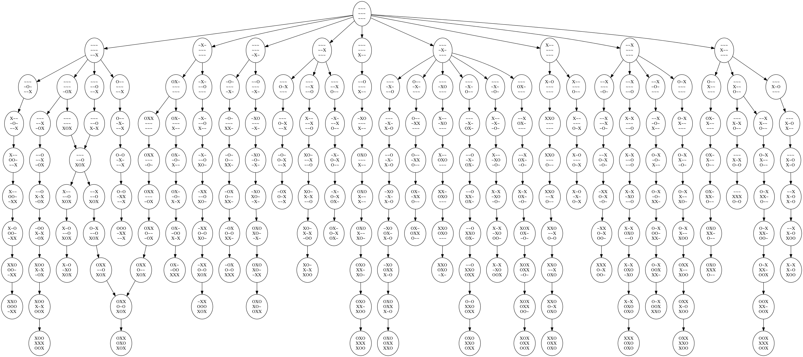
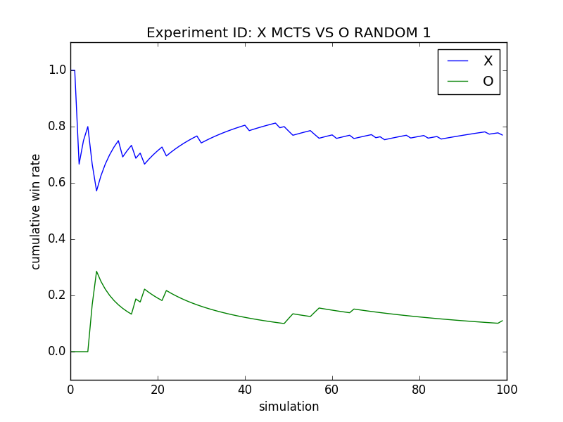
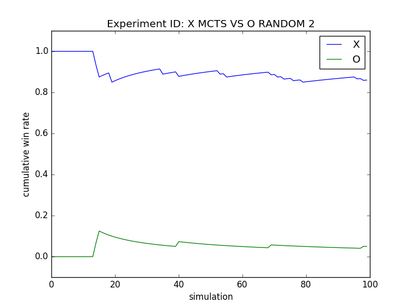
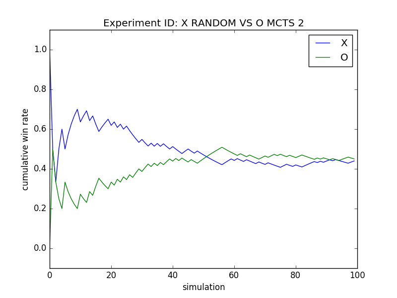
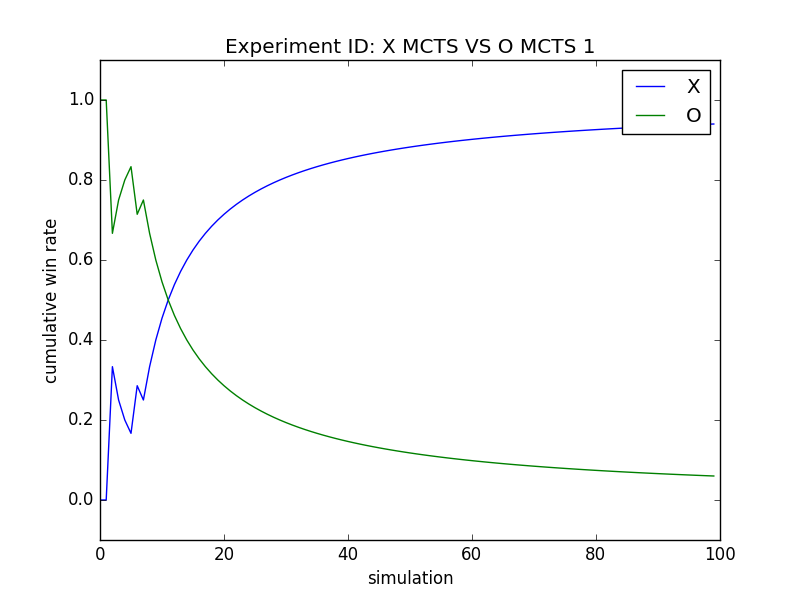

# Monte-Carlo Tree Search implementation for Tic Tac Toe

## Core files
- **gamestate.py** Defines a Tic Tac Toe game state object with an associated transition function, a legal moves function, a move function, and a terminal state detector. Includes unit tests to verify proper functionality.
- **gameplay.py** Function to play a game given a policy for each player and keep track of the game as a NetworkX game tree.
- **policies.py** Game play policies can be defined here. Currently the following policies are defined: MCTSPolicy, RandomPolicy

## Experiments
**example_figures.py** Generates sample figures visualizing game trees.

First, it generates one [game graph](game_graph.png).

Then, it plays multiple games, and [composes their graphs](multiple_game_graph.png):

**experiments.py** Runs many simulations under different policy combinations, keeps track of the cumulative win rates and plots the results.

['x_mcts_vs_o_random_1',
         'x_mcts_vs_o_random_2',
         'x_random_vs_o_mcts_1',
         'x_random_vs_o_mcts_2',
         'x_mcts_vs_o_mcts_1',
         'x_mcts_vs_o_mcts_2',
         'x_random_vs_o_random_1',
         'x_random_vs_o_random_2']

### X MCTS vs O Random
#### Trial #1

#### Trial #2

### X Random vs O MCTS
#### Trial #1

#### Trial #2

### X MCTS vs O MCTS
#### Trial #1

#### Trial #2

### X Random vs O Random
#### Trial #1

#### Trial #2

## Parameter Settings
- Trials #1 and #2 were conducted with a computation budget of 25 and were run for 100 simulations

## Requirements
Requires NetworkX and GraphViz, which are included in the free [Anaconda](https://www.continuum.io/downloads) Python distribution or can be installed separately.
